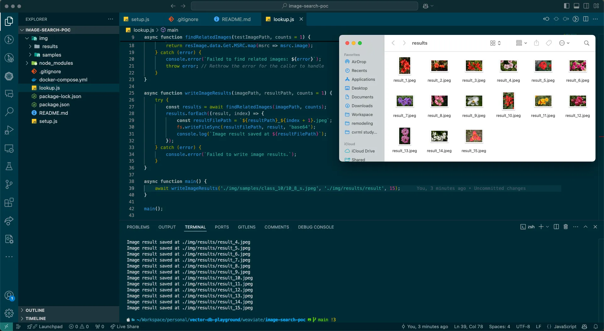

# Vector Database and HNSW Index

This is a quick demo of the HNSW Index in Weaviate.

## Running the demo
Start the Weaviate database with the following command:
```bash
docker-compose up
```

Add the sample images and load them with `setup.js`
```bash
node setup.js
```

Retrieve the similar results with `lookup.js`
```bash
node lookup.js
```
